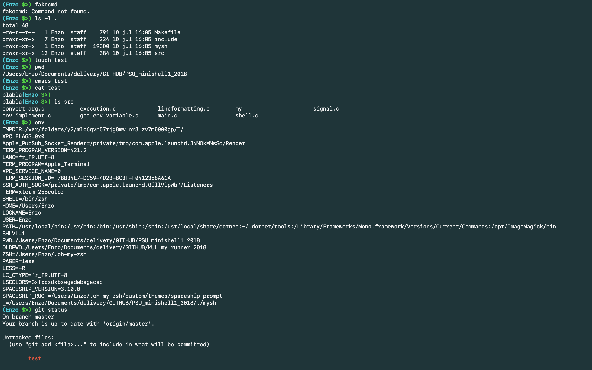

# PSU_minishell1_2018
Réalisation d'un interpréteur de commande (type Shell tcsh) en C

## FONCTIONNEMENT

DESCRIPTION : 
- Fonctionnalités classique d'un Shell
- Gère le ^C
- Quelques bonus comme le prompt personnalisé

UTILISATION : 
./mysh

## FUNCTIONMENT

DESCRIPTION : 
- Classic shell functionality
- Manage the ^C function
- Few bonus such as custom prompt

USAGE : 
./mysh

**************

### Quick Preview

